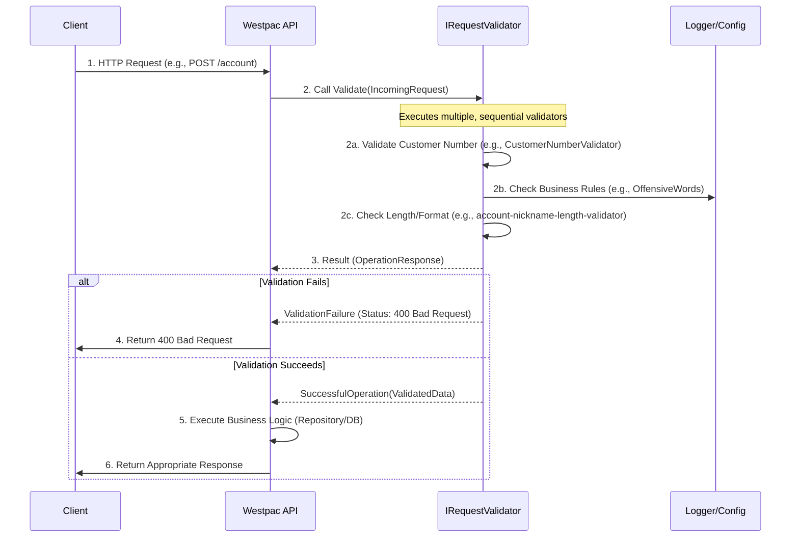
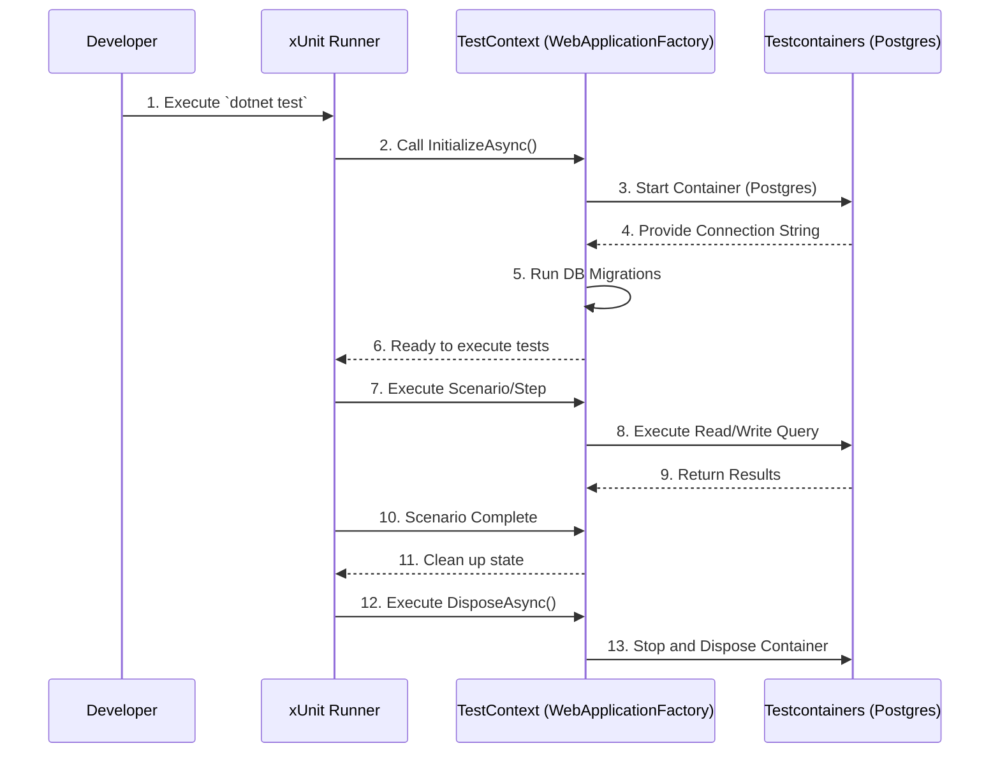
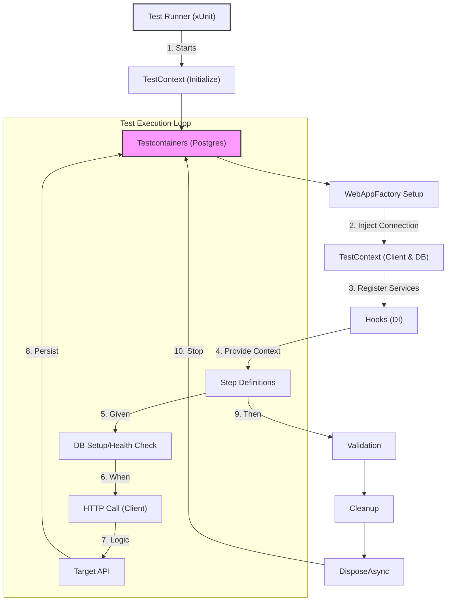
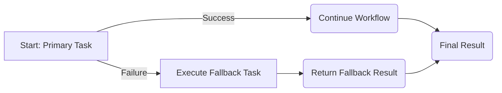

# Account Creation Service Overview

The system has four projects

1. `Westpac.Evaluation.DomainModels` - This contains the core domain models that all the projects in this solution use. Think higher level concerns like `Result` pattern with extensions and more
2. `Westpac.Evaluation.SavingsAccountCreator` - This is the Core WebAPI of the Account Creation Service
3. `Westpac.Evaluation.Testing.Unit.SavingsAccountCreator` - This contains Unit Tests for the API application
4. `Westpac.Evaluation.Testing.Integration.SavingsAccountCreator` - This contains Integration Tests for the API application

**Note:** There is a GitHub action currently that just builds the applications and runs tests (unit and integration) - we are not deploying to anywhere at this stage.

> There is an AGENTs.md file in the root of the repo that specific instructions so that Agents (OpenCode, ClaudeCode etc) know how to add features and add tests based on "how things are structured and done" in this repository

# Westpac.Evaluation.SavingsAccountCreator

This microservice provides standardized endpoints for creating and retrieving customer and savings account information, ensuring high data integrity through rigorous validation and transactional consistency.

This guide will walk you through setting up the environment, understanding the API architecture, and utilizing the core features, including database management and request validation.


> This API has endless possibilities but this project in it's current state is not a productionised solution.
> Few notable things that need to go in before production are
> * Observability - Histograms, Gauges and Metrics of that nature for the application
> * Caching - Add a cache layer of Redis prior to the database layer
> * Monitoring - Add a monitoring layer when the application is down or something is wrong with it
> * Security - Add a security layer of Open Policy Agent or Zap or any other security layer for this API
> * Deployment - Add a deployment layer of Kubernetes, et.al


## ️ Architecture Overview

The API follows a robust pattern of separating validation logic from business logic. All incoming requests are first routed through a dedicated `IRequestValidator` pipeline, ensuring that data adheres to all defined business rules (e.g., name length constraints, valid branch codes, non-offensive content) before any database interaction occurs.

### API Endpoints

The API endpoints are grouped under `/api/v1/` and provide the following functionalities:

| Method | Route | Description | Request Body |
| :--- | :--- | :--- | :--- |
| `POST` | `/api/v1/customer` | Creates a new customer record in the system. | `CreateCustomerRequest` |
| `POST` | `/api/v1/account` | Creates a new savings account linked to a customer. | `CreateAccountRequest` |
| `GET` | `/api/v1/account` | Retrieves all accounts associated with a given customer number. | Query Parameter: `customerNumber` |

---

## Getting Started

### 1. Prerequisites

Before you begin, ensure you have the following installed:

*   .NET SDK 10.0 (or newer)
*   Docker and Docker Compose

### 2. Database Setup (Dependencies)

This API relies on a PostgreSQL database for persistence. We recommend using `docker-compose` to spin up a local, isolated instance of the required database.

**Steps:**

1Run the following command in your terminal:

```shell script
docker-compose up -d
```


This command will download the Postgres image and start the `SavingsAccountDatabase` container, making it accessible at `localhost:5432`.

### 3. Project Setup and Dependencies

Navigate to the root directory of the solution.

1.  **Restore Packages:**
```shell script
dotnet restore
```


2.  **Initialize Database Schema (Migrations):**
    Since the API uses Entity Framework Core with Npgsql, you must apply the database migrations to create the necessary tables.

    Using the specified `dotnet-ef` tools:
```shell script
    dotnet tool restore
    dotnet-ef database update
```

**Note:** This assumes that you have set the environment variable of `MIGRATION_CONNECTION_STRING` to the correct connection string for the database when running migrations.For the application the connection string sits at `ConnectionStrings:DefaultConnection` in `appsettings.json`.


---

##  Running the Application

### Running Locally

To run the API in a development environment, use the following command:

```shell script
dotnet build && dotnet run --environment Development
```


### Health Checks

The application automatically maps the following health check endpoints for operational monitoring (useful for container orchestration like K8s):

*   **Liveness:** `/health/liveness`
*   **Readiness:** `/health/readiness`

---

##  API Documentation & Discovery

### OpenAPI Specification

The API supports OpenAPI documentation via two primary endpoints, ensuring that external clients and internal developers have clear, machine-readable documentation.

1.  **Swagger/Swagger UI (OpenAPI):**
    When running in the development environment, API documentation is available via the standard `MapOpenApi()` route at `/{api_url}/openapi/v1.json`.

2.  **Scalar UI:**
    For a modern, interactive, and component-based API reference, the API exposes the Scalar route:
    *   **Route:** `/{api_url}/scalar`

This route allows developers to explore all available endpoints, schemas, and required parameters in a seamless, documented interface.

## Input Validation (`IRequestValidator`)

One of the features of this API is its proactive input validation layer, managed by the `IRequestValidator<TUnValidatedRequest, TValidatedRequest>` interface. This pattern enforces strong contract adherence and shields core business logic from malformed or malicious inputs.

### How Validation Works (Flow Diagram)

The request flow follows this sequence:




### Details on Validation Implementation

*   **Purpose:** The validators transform a raw incoming request (`TUnValidatedRequest`) into a type-safe, business-validated model (`TValidatedRequest`).
*   **Failure Handling:** If any validation check fails, the process immediately halts and returns a `ValidationFailure` object, preventing database transactions from starting.
*   **Key Validators:**
    *   `CustomerNumberValidator`: Ensures the input string is composed entirely of digits and can be successfully parsed into a `long` integer.
    *   `InputLengthAndNonEmptyStringValidator`: Checks minimum and maximum character lengths and ensures the field is not null or whitespace.
    *   `SavingsRequestValidator`: Performs complex orchestration, checking customer numbers, validating branch codes (against configured `ValidBranchCodes`), and filtering for sensitive/offensive words within the account nickname.

### Configuration

Validation rules can be customized through the `appsettings.json` file, allowing environment-specific adjustments:

*   **`OffensiveWords`**: Defines an array of words that will trigger a validation failure if they are found within the account nickname.
*   **`SavingsAccountCreation`**: Contains business constants such as `MaxAccountsPerCustomer` and `ValidBranchCodes`, which are critical validation inputs.

---

# Westpac.Evaluation.Testing.Unit.SavingsAccountCreator

This repository contains a comprehensive suite of unit tests designed to validate the business logic and data integrity of the `SavingsAccountCreator` module. The tests ensure that input requests are processed robustly, adhere to complex domain rules, and fail gracefully when invalid data is provided.

This unit test project uses Moq to isolate the dependencies and isolate the unit under test (SUT). There is a separate test project for integration tests that test the full system stack.

## Getting Started

### Prerequisites

*   .NET SDK 10.0 or higher (Targeting `net10.0`)

### Installation and Dependencies

The project is self-contained, but running the tests requires the dependencies specified in the `.csproj` file:


1. **Restore Packages:** Use the .NET CLI to restore all required NuGet packages.
```shell script
dotnet restore
```
2. **Run Tests:** To run the tests
```shell
dotnet test
```

## 💡 Core Testing Concepts

### 1. Testing Framework: xUnit
The project utilizes **xUnit** (`xunit` package) as its primary testing framework.
*   Tests are organized using attributes like `[Fact]` (for a single scenario) and `[Theory]` (for parameterized testing, running the same test logic against multiple sets of input data, e.g., valid/invalid strings).
*   This ensures high coverage by systematically testing boundary conditions (min/max lengths, nulls, whitespace).

### 2. Mocking Dependencies: Moq
We use **Moq** to isolate the unit under test (SUT). Instead of relying on actual implementations of services (like database access, or other external validators), we create *mocks*.
*   **Purpose:** Mocks allow us to simulate the precise behavior of dependencies, ensuring that when `ValidatorA` calls `DependencyB`, we can force `DependencyB` to return a specific success or failure result, regardless of its actual implementation.
*   **Example:** In `CreateCustomerValidatorTests`, we mock the `IRequestValidator<string?, long>` to control whether the customer number validation succeeds or fails.

### 3. The Validation Flow (`IRequestValidator`)

The most critical component tested is the validation pipeline, which relies on the `IRequestValidator` pattern.

**How Request Validation Works:**

A core validator (e.g., `SavingsRequestValidator`) does not implement the full validation logic itself. Instead, it orchestrates the validation by composing several smaller, specialized validators (e.g., `CustomerNumberValidator`, `InputLengthValidator`).

**Note:** There are individual tests for each of these more focused validation steps as well.

1.  The main validator receives a comprehensive `request` object.
2.  It extracts individual fields and calls the dedicated validator dependency for that field.
3.  Each dependency runs its specialized logic (e.g., regex check, length check, lookup table validation).
4.  Validation results are wrapped in an `OperationResponse<T, ValidationFailure>` - where `ValidationFailure` contains the error details including a request model
5.  **Fail-Fast Mechanism:** If *any* called validator returns a `FailedOperation`, the orchestrating validator immediately stops processing and returns the first failure found, preventing the use of invalid data in subsequent steps.


---

## Westpac.Evaluation.Testing.Integration.SavingsAccountCreator

This project serves as the comprehensive integration testing layer for the Westpac Savings Account Creation service. It utilizes a modern, robust, and highly isolated testing architecture based on **Behavior Driven Development (BDD)**, ensuring that the business logic is tested against a real, ephemeral backend environment (PostgreSQL) without relying on the application's internal state or external network dependencies.

The goal of this suite is to validate complex transactions, enforce business rules (like account limits), and confirm proper error handling (like database unavailability) in an environment that closely mimics production.

## Key Architectural Components

Our testing framework is built on the following pillars:

1.  **Behavior Definition (`.feature`):** Using Gherkin syntax to define *what* the system should do from a business perspective in PLAIN English with GIVEN, WHEN, THEN statements.
2.  **Step Definitions (`StepDefinitions.cs`):** Implementing the glue code that maps Gherkin steps to executable C# methods.
3.  **Test Context (`TestContext.cs`):** Manages the entire lifecycle of the dependencies, most notably the ephemeral PostgreSQL database container.
4.  **Behavior Framework (`Reqnroll`):** The library responsible for parsing the `.feature` file, managing scenario execution flow, and handling dependency injection between steps.
5.  **Containerization (`Testcontainers`):** Provides true isolation by spinning up and tearing down external services (like Postgres) for each test run programmatically from the application's test suite.

## Getting Started

### Prerequisites

Before running the tests, ensure you have the following installed:

*   **.NET SDK:** (Must match the target framework, e.g., `net10.0`).
*   **Docker:** The `Testcontainers` library depends on Docker to provision and manage the isolated PostgreSQL database instance.

###  Installation and Build


2.  **Restore Dependencies:**
```shell script
dotnet restore
```

3.  **Run Tests:** Use the standard `dotnet test` command - this takes care of bringing up dependencies including the PostgreSQL container and also cleans up after itself.
```shell script
dotnet test 
```


## Deep Dive: How the System Works

### 1. Database Isolation with TestContainers

The most critical aspect of this project is how the database is handled. We use `Testcontainers` to manage a clean, isolated PostgreSQL instance for the duration of the test suite.

*   **Initialization (`TestContext.InitializeAsync`):**
    *   A dedicated `PostgreSqlContainer` is started via `Testcontainers`.
    *   The connection string is programmatically injected into the application's service configuration.
    *   Database migrations (`db.Database.MigrateAsync()`) are executed to set up the schema.
*   **Isolation:** Each test run operates against this container, ensuring that test A's actions cannot pollute or depend on the state left by test B.
*   **Teardown (`TestContext.DisposeAsync`):** When all tests are complete, the container is gracefully stopped and disposed of, freeing up system resources.

**Lifecycle Flow:**




### 2. Behavior Driven Development (BDD)

The testing logic is separated into clear concerns:

#### The Behavior (`.feature` files)
The `SavingsAccount.feature` file defines the business requirements using human-readable Gherkin language. It specifies:
*   **Background:** Actions that must happen before *every* scenario (e.g., "the bank account API is running").
*   **Scenarios:** Individual test cases (e.g., "Successfully create a new savings account").
*   **Steps (`Given`, `When`, `Then`):** The narrative flow of the test.

#### The Implementation (`StepDefinitions.cs`)
This file contains the actual C# methods decorated with `[Given]`, `[When]`, and `[Then]` attributes. These methods implement the logic described in the `.feature` file.

#### The Glue (`DependencyInjectionHooks.cs`)
The `DependencyInjectionHooks` class is crucial. It uses `[ScenarioDependencies]` to:
1.  Ensure the `TestContext` is available as a singleton throughout the test run (since the DB container must stay up).
2.  Register the `SavingsAccountStepDefinitions` class so that the Reqnroll framework can inject it and execute its step methods.

### 3. State Management and Context

The `TestContext` class acts as the central **service provider** for all integration tests.

*   **HttpClient:** It provides an `HttpClient` wrapper that is pre-configured to point to the application logic while using the dynamically injected database connection string.
*   **State Helpers:** It provides state-management methods like `CreateCustomer()`, `CreateMultipleAccountsForCustomer()`, and `GetAccountsForCustomer()`. These methods encapsulate complex database queries, allowing the `StepDefinitions` to read or write to the test environment cleanly without writing raw SQL.

##  Test Execution Flow Diagram

This diagram illustrates how a single scenario executes, showing the flow of control and data between the components.




---
## Westpac.Evaluation.DomainModels

### Project Overview: Robust Asynchronous Result Handling

This project introduces a robust pattern for handling asynchronous operations and fallible processes, designed to ensure predictable execution flow, clear separation of concerns, and type safety.

By implementing the `OperationResponse` record pattern, we move away from traditional exception-based error handling, providing a structured container that explicitly carries either a successful result (`TSuccess`) or a specific failure reason (`TFailure`).

### 💡 Core Concepts

### 1. The `OperationResponse` Pattern (Result Monad)

Instead of allowing methods to throw exceptions or return simple values that might be `null`, all operations are wrapped in `OperationResponse<TSuccess, TFailure>`. This forces the caller to explicitly consider both success and failure paths.

*   **`SuccessfulOperation<TSuccess>`**: Carries the expected result data.
*   **`FailedOperation<TFailure>`**: Carries the reason for failure.

This structure significantly improves code readability, maintainability, and guarantees that failure paths are handled at the call site.

### 2. Handling Multiple Return Types with `Match`

A key challenge in complex business logic is when different execution paths (success vs. failure) need to ultimately yield different resultant data types.

The `Match<T, U, TResult>` extension method addresses this by providing overloaded versions that map the results of potentially different input types (`T` and `U`) into a single, coherent output type (`TResult`). This pattern allows the execution logic to effectively "co-locate" the successful and failure processing while ensuring the final result is of the required type.

```mermaid
graph TD
    A[Start Operation: Task<OperationResponse<T, U>>] -->|SuccessfulOperation| B{Execute Success Path};
    A -->|FailedOperation| C{Execute Failure Path};
    B -->|Success Func (T -> TResult)| D[Result: TResult];
    C -->|Error Func (U -> TResult)| E[Result: TResult];
    D --> F(Final TResult);
    E --> F;
```


### 3. Ensuring No Side Effects (Side Effect Isolation)

In critical asynchronous workflows, sometimes we need to perform actions (like logging, updating a cache, or emitting an event) after a successful operation completes, but we must *guarantee* that these side effects do not influence or override the primary result.

The `RunSideEffect` extension method addresses this concern:

1.  It waits for the primary `OperationResponse` to resolve.
2.  If the response is successful, it executes the provided side effect function using the success data.
3.  **Crucially**, regardless of whether the side effect function itself throws an exception or completes successfully, the method returns the original `OperationResponse` container containing the primary result.

This pattern effectively isolates side effects, adhering to the principle that the side effect execution should not change the outcome of the main operation.


```mermaid
graph TD
    A[Start: Task<OperationResponse<T, TU>>] --> B{Await Primary Result};
    B -->|SuccessfulOperation (SuccessData)| C[Execute Side Effect (T -> Task)];
    C --> D{Side Effect Completes (Ignoring Result)};
    D --> E[Return Original OperationResponse<T, TU>];
    B -->|FailedOperation| E;
```


### 4. Implementing Fallbacks

The `FallbackTo` extension method provides a clean and straightforward mechanism for recovery. If the primary operation fails (`OperationResponse.FailedOperation`), the workflow can automatically transition to a specified fallback function, allowing for structured error recovery without complex nested try-catch blocks.

**Mermaid Diagram: Fallback Flow**




### Summary of Best Practices

| Feature | Type Handling | Problem Solved |
| :--- | :--- | :--- |
| **`OperationResponse`** | Structured result type | Replaces exceptions for predictable flow. |
| **`Match`** | Handles multiple input types $\rightarrow$ single output type | Enables clean transformation and type coalescence. |
| **`RunSideEffect`** | Output type preserved | Guarantees that side effects do not affect the final result. |
| **`FallbackTo`** | Conditional flow path | Provides clean, structured error recovery logic. |

---